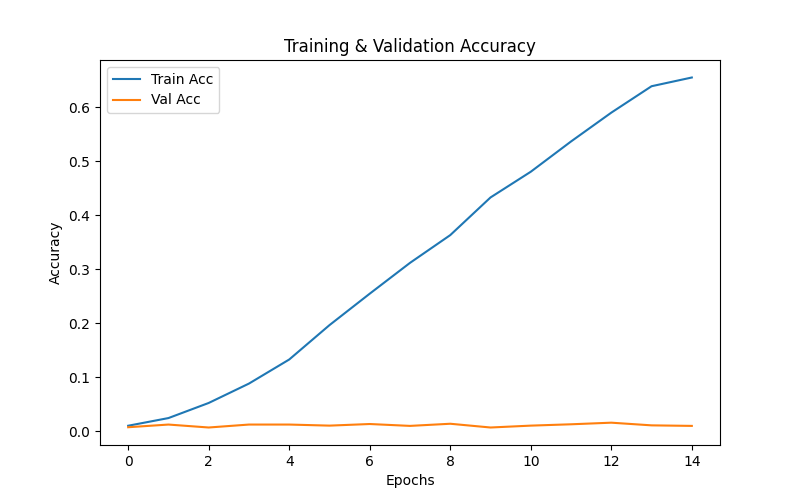
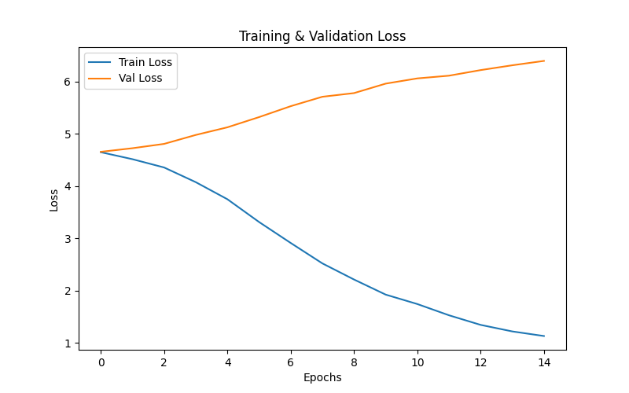

# Seq2Seq Transliteration: Latin to Devanagari

##  Project Overview  
This project implements a **character-level Sequence-to-Sequence (Seq2Seq)** model for transliterating **Latin script** to **Devanagari script** using the **Aksharantar dataset (AI4Bharat)**.  

The model learns to convert romanized text (e.g., *ghar*) to its corresponding Devanagari representation (e.g., *घर*).  

**Assignment:** IIT Madras - Deep Learning Technical Aptitude  
**Dataset:** Aksharantar (AI4Bharat)  
**Task:** Character-level transliteration using RNN-based Seq2Seq architecture  

---

##  Problem Statement  
Given pairs of `(Latin_script, Devanagari_script)` such as:  
- (ghar, घर)  
- (ajanabee, अजनबी)  
- (kitab, किताब)  

Build a model  
\[
f(x) = y
\]
that takes a romanized string as input and produces the corresponding word in Devanagari script.

---

##  Model Architecture

### Core Components  
1. **Input Layer (Character Embeddings)**  
   - Converts character indices to dense vectors  
   - Configurable embedding dimension  

2. **Encoder RNN**  
   - Processes Latin character sequences sequentially  
   - Produces hidden state representation  
   - Supports RNN / LSTM / GRU  
   - Configurable number of layers  

3. **Decoder RNN**  
   - Takes encoder’s final hidden state as initial state  
   - Generates Devanagari characters one at a time  
   - Uses teacher forcing during training  

### Architecture Flow  
Input (Latin): "ghar"
↓
[Character Embedding Layer]
↓
[Encoder RNN] → Hidden State
↓
[Decoder RNN] ← Hidden State (initial)
↓
Output (Devanagari): "घर"


###  Configurable Parameters  
| Parameter | Description |
|------------|-------------|
| `embedding_dim` | Dimension of character embeddings |
| `hidden_dim` | Hidden state size for encoder/decoder |
| `num_encoder_layers` | Number of encoder RNN layers |
| `num_decoder_layers` | Number of decoder RNN layers |
| `cell_type` | RNN / LSTM / GRU |
| `dropout` | Dropout probability |
| `learning_rate` | Optimizer learning rate |
| `batch_size` | Training batch size |

---

##  Theoretical Analysis  

###  Total Computations (1 layer each)

**Given:**  
Embedding size = *m*, Hidden size = *h*, Sequence length = *n*, Vocabulary size = *V*  

**For LSTM-based Seq2Seq:**  
- Encoder: `n × 4(hm + h²)`  
- Decoder: `n × 4(hm + h²)`  
- Output: `n × hV`  
→ **Total:** `O(n[8hm + 8h² + hV])`

**For RNN:**  
→ `O(n[2hm + 2h² + hV])`

**For GRU:**  
→ `O(n[6hm + 6h² + hV])`

---

### Total Parameters (LSTM, 1 layer each)

**Embedding Layer:** `V × m`  
**Encoder LSTM:** `4(h×m + h×h + h)`  
**Decoder LSTM:** `4(h×m + h×h + h)`  
**Output Layer:** `h × V + V`

**Total Parameters:**  
\[
V(m + 1) + 8h(m + h + 1) + hV
\]

**Example (m=128, h=256, V=100):**  
≈ **1,615,460 parameters**

---

##  Implementation Features  
✅ Character-level embeddings  
✅ Encoder–Decoder RNN (configurable architecture)  
✅ Support for RNN, LSTM, GRU  
✅ Teacher Forcing for stability  
✅ Gradient clipping + LR scheduling  
✅ Loss and accuracy visualization  
✅ Model checkpointing  

---

##  Additional Features  
- **Special Tokens:** `<PAD>`, `<SOS>`, `<EOS>`, `<UNK>`  
- **Efficient batching and padding**  
- **Custom collate function** for variable sequence lengths  
- **Word-level accuracy & character error rate evaluation**

---

##  Installation & Setup  

### Requirements  
torch>=1.9.0
numpy>=1.19.0
pandas>=1.2.0
matplotlib>=3.3.0
tqdm>=4.50.0


### Steps  

# Clone the repository
git clone https://github.com/navyasgr/sequence2sequence-IITM.git
cd sequence2sequence-IITM

# Install dependencies
pip install -r requirements.txt
 Usage
 Run Locally

python seq2seq_complete.py
 Google Colab / Kaggle

!git clone https://github.com/navyasgr/sequence2sequence-IITM.git
%cd sequence2sequence-IITM
!pip install -r requirements.txt
!python seq2seq_complete.py
 Project Structure
```
Seq2Seq-IITM/
│
├── seq2seq_complete.py         # Main implementation
├── requirements_txt.txt        # Dependencies
├── jupyter_notebook.py         # Colab-compatible notebook
├── docs/
│   └── README.md - Complete Documentation.pdf
│
├── results/
│   ├── accuracy_curve.png
│   ├── loss_curve.png
│
└── .gitignore
```
## Training Results

| **Accuracy Curve** | **Loss Curve** |
|---------------------|----------------|
|  |  |


## Experiments & Analysis
Effect of Cell Type
Cell Type	Parameters	Training Speed	Performance
RNN	Lowest	Fastest	Good
GRU	Medium	Fast	Better
LSTM	Highest	Slowest	Best

Effect of Hidden Size
Hidden Size	Parameters	Memory	Performance
128	~400K	Low	Good
256	~1.6M	Medium	Better
512	~6.4M	High	Best

Troubleshooting
CUDA Out of Memory:

CONFIG['batch_size'] = 32
CONFIG['hidden_dim'] = 128
Model Not Learning:

CONFIG['teacher_forcing_ratio'] = 0.7
CONFIG['learning_rate'] = 0.0001
Overfitting:

python
Copy code
CONFIG['dropout'] = 0.5
## References
Sequence to Sequence Learning with Neural Networks – Sutskever et al., 2014

Neural Machine Translation by Jointly Learning to Align and Translate – Bahdanau et al., 2014

Aksharantar Dataset – AI4Bharat

Understanding LSTM Networks – Christopher Olah

 Author
Navya
GitHub: @navyasgr
Repository: Seq2Seq-Aksharantar-IITM-navya

 License
This project is created for educational purposes as part of the IIT Madras Deep Learning course assignment.

 Acknowledgments
IIT Madras – Technical Aptitude Round

AI4Bharat – Aksharantar dataset

PyTorch Team – Excellent framework

 Contact & Support
For questions or issues:

Open an issue on GitHub

Contact via IIT Madras course portal

🕒 Last Updated: October 2025
